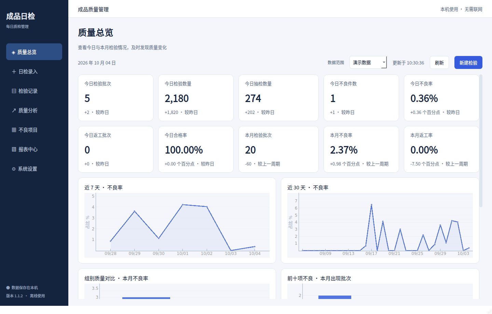
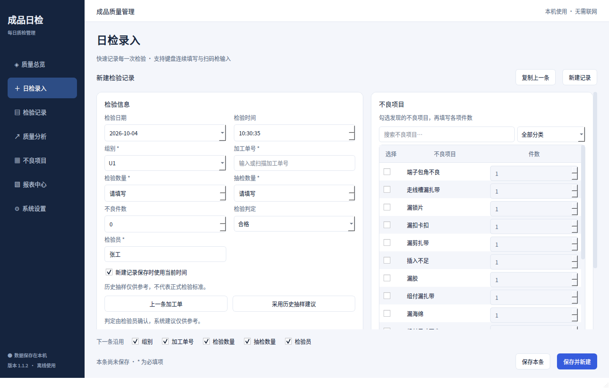
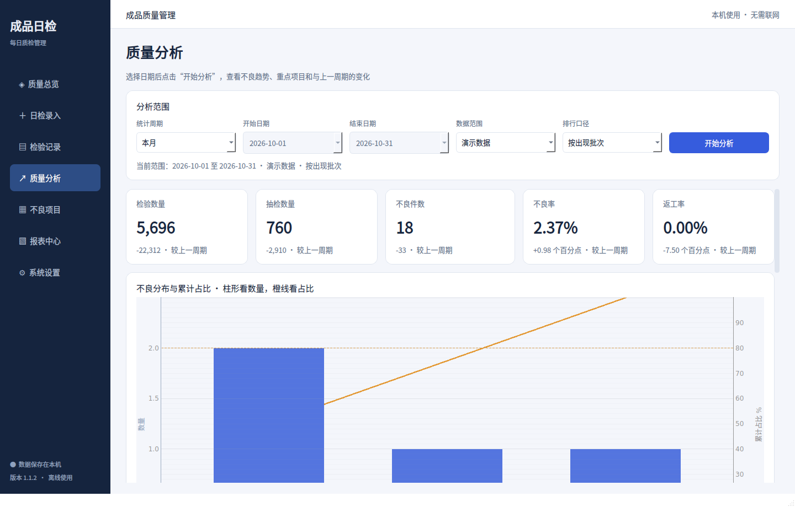

# Product-QC-Daily · 成品日检管理系统

把 Excel 日检表升级为可长期使用的本地桌面软件。**Windows 单机离线运行，SQLite 保存数据，不需要服务器、Docker、MySQL 或浏览器后端。**

[Windows 下载](https://github.com/zerlinpi/Product-QC-Daily/releases/latest) · [构建与测试](https://github.com/zerlinpi/Product-QC-Daily/actions) · [原表分析](docs/excel-analysis.md) · [架构](docs/architecture.md)



## Windows 用户

1. 在 Releases 下载 `Product-QC-Daily-windows-x64.zip`。
2. 解压整个压缩包；保留 EXE 和 `_internal` 文件夹的相对位置。
3. 双击 `Product-QC-Daily.exe`，**不需要安装 Python 或 Excel**。
4. 在“系统设置”填写公司、默认组别和检验员；在“报表中心”导入原表，先检查预览与异常报告。

支持 Windows 10/11 64 位。首次运行会创建数据库和初始 24 项字典。程序没有更新服务器，也不上传任何检验数据。未签名 EXE 可能出现 Windows 信任提示；启动自检成功不代表发布者受信任。ZIP 内 `signature-verification.json` 记录真实签名状态。维护者需配置经过身份验证的签名服务，详见 [Windows 签名说明](docs/windows-signing.md)；有效签名也不能保证新版本立即免除 SmartScreen 信誉提示。

## 日常操作

1. **日检录入**：填写带 `*` 的必填项，点击“保存本条”；连续录入选“保存并新建”，“下一条沿用”决定保留哪些字段。
2. **检验记录**：设置条件后点击“查询”。修改筛选但尚未查询时，页面会明确提示当前表格仍是上一次查询结果，分页暂时禁用，导出也会说明仍按当前表格范围执行。选择记录后可编辑、复制或批量修改；右键会以鼠标所在记录为操作目标；“查看回收站”可恢复已删除记录。
3. **导出表格**：没有选中记录时，“导出列表”导出查询结果的全部页；选中后，按钮显示“导出已选 N 条”。默认“原表格式”保留原表布局，“明细报表”保留检验员、备注和逐项件数。
4. **质量分析**：选择日期和数据范围后点击“开始分析”；按出现批次查看常见不良，按已填件数查看已记录的数量。

界面、日期选择和确认弹窗统一使用中文；Windows 正常桌面运行优先使用 WindowsVista / Windows 原生 style，按钮、输入框、下拉框、日期框、菜单、表格表头、复选框和滚动条不再由全局 QSS 重绘。左侧页面导航使用原生列表控件，不再使用网页式按钮侧栏。Excel 导出使用系统原生文件保存窗口。回收站、清理演示数据及恢复备份的确认按钮直接写明操作，默认选中取消。

## 主要功能

- **快速录入**：日期/时间、组别、工单、数量、可视化不良多选及逐项数量、人工判定、检验员、PNG/JPG 签名、备注。
- **连续填写**：保存、保存并新建、复制上一条/选中记录、保留五个常用字段、历史工单补全、上一工单、历史抽样建议、扫码枪键盘输入。
- **快捷键**：Ctrl+S 保存；Ctrl+N 新建；Ctrl+D 复制上一条；Enter 跳转下一项。连续点击保存会更新当前记录，不会意外新增重复记录。
- **检验记录**：服务器无关的 SQLite 分页（50 条/页）、表头排序、日期/组别/工单/检验员/判定/不良项目/是否有不良/数据来源筛选、右键菜单、批量改组别和检验员、批量导出、软删除及恢复。
- **质量总览与分析**：今日/本月指标，7/30 天趋势、组别对比、前十项不良、不良排名、合格/返工批次、不良分布柱形及累计曲线、80% 项目、上一周期对比。
- **字典与组别**：新增、编辑、搜索、排序、停用；历史记录不因停用丢失。
- **Excel**：预览、异常报告、重复检测、编号冲突检测；预览前后以分块流式 SHA-256 校验源文件，预览期间被 Excel/同步盘改写的文件会要求重新预览；大体积工作簿校验不会再整文件复制到内存。明细报表和原模板兼容格式；正常记录原子导入，异常不静默修正。
- **数据维护**：完整 ZIP 备份、每日自动备份、保留期限、恢复前快照、数据库健康检查、日志、schema_version 迁移。
- **演示数据**：数量、日期、组别、返工率（合格率互补）、不良率目标和项目权重可调，始终 `source=demo`；生成窗口默认覆盖当前完整年度，年度/跨月范围进入对应质量分析；默认统计排除演示，一键清理只删除演示记录。
- **界面**：七个工作页面，浅色/深色/跟随系统；筛选项清晰标注、记录筛选可一键重置、批量操作按选择状态启停，分析/报表显示当前范围；质量分析、检验记录和报表中心都会在开始日期晚于结束日期时直接阻止执行并提示修正，F5 不会用无效日期重新查询。支持 Ctrl+1–7 页面导航、Ctrl+F 搜索和 F5 刷新，后台执行导入、导出和维护任务，窗口尺寸记忆。




## 统计口径

| 指标 | 定义 |
|---|---|
| 不良率 | 不良件数合计 ÷ 抽检数量合计 |
| 合格率 / 返工率 | 相应判定批次 ÷ 检验批次 |
| 项目出现批次 | 选择该不良项目的检验批次数 |
| 项目已知件数 | 只合计实际填写的数量；未知数量保留 NULL |
| 上一周期 | 当前日期区间前紧邻、长度相同的日期区间 |

所有统计使用完整起止日期，周按周一至周日，可跨年。旧表 `eg` 只说明 e/g 两项出现，不说明各有多少件；**不会擅自平均分配或记作一件**。同一件可有多个不良，项目件数合计可能高于不良件数。发现不良不自动推翻检验员的“合格”判定。

## 原始 Excel 兼容

详见 [分析报告](docs/excel-analysis.md)。默认使用可见的“成品日检表”，不重复导入隐藏历史副本。原表 460 条非空记录的实际验证：429 条正常、5 条字段/数量异常、26 条无法识别编码；429 条正常记录的签名已可解析。未将原始生产数据或签名提交到公开仓库。

模板 `templates/成品日检表模板.xlsx` 是原工作簿的**空白脱敏模板**，保留四个工作表、表头、字体、行高、隐藏列、合并，以及六张图表的位置、大小和样式。当前原表导出沿用模板日期格式与列宽；明细报表使用加宽的完整日期时间列。签名在原单元格内等比缩放。兼容导出修复年月/周区间、末尾三项排名、w/x 错误编码和不良率口径；L/M 列记录本次导出的统计日期范围。模板隐藏副本保持空白，防止二次导入重复统计；隐藏 N 列保存中文数据来源，演示记录重新导入后仍保持隔离。

v1.1.45 的原表图表明确区分全年/区间与“截止周”（仅本次明细中结束日期所在周），超过八组时用最后一个分类显示其他组别合计。年度打印范围随记录数扩展并重复表头；明细、摘要、月度统计和图表使用同一批记录。导出前后的数量变化会提示刷新重试，不覆盖已有文件。详见 [专项验收记录](docs/export-stability-v1.1.45.md)。Excel/WPS 实际重算、滚动、保存和打印仍需实机验收，不能用自动结构检查代替。

v1.1.46 恢复原表内的月份切换：在 **“数据分析表”A2** 下拉选择 `2026-01` 等年月；选择 **“全部”** 查看本次导出范围，跨年月份分别列出。上方三图随所选期间重算，下方三图显示该期间结束日期所在周（仅包含本次导出记录，可跨到相邻月份）。在 **“成品日检表”的“时间”列** 使用筛选查看单月明细；筛选记录与选择统计月份是各自工作表的操作。两种报表的不良项目均显示字典中的中文名称，原表按需换行增加行高；内部编码放在隐藏列以保持统计与导入关联。重新导入时会核对名称与编码，不会静默采用被修改名称对应的旧编码。详见 [本轮验收记录](docs/export-stability-v1.1.46.md)。

检验记录页导出默认使用原表格式，可在 Windows 系统原生保存窗口的文件类型中改选明细报表；报表中心点击“按原表导出”。来源显示为“手动录入 / 表格导入 / 演示数据”，旧版英文来源文件仍可导入。

明细报表包含检验记录、不良明细、字典、统计摘要和月度统计；检验记录增加“月份”筛选列，年度导出可直接按月筛选可见数据。标准报表采用打印友好的 A4 布局、重复表头、内容化列宽和长备注换行；检验记录冻结首行与前两列，宽表横向查看时仍能看到记录 ID 和时间，合格/返工有轻量视觉区分。月度统计包含合计行、按指标独立缩放的数据条、检验批次柱状图和质量率趋势图；月份筛选不包含合计行。标准报表页眉/页脚会带上系统设置中的公司/工厂、Sheet 名、日期范围、数据来源、页码和文件名，便于打印与归档；公司/工厂名称中的 `&` 会安全转义。统计摘要区分核心指标与口径说明。报表中心自定义日期若开始晚于结束，界面会直接禁用导出并提示修正日期。明细报表支持重新导入并保留已知逐项数量。导入前请先创建报表涉及的自定义组别/字典。旧兼容格式只支持 a–x，新编码请使用明细报表。WPS `DISPIMG` 签名和普通浮动签名可提取，导出为普通 Excel 图片；反馈图片不是第一版的记录附件字段，原文件仍保留它们。

Windows 安装 Excel 时会尝试 COM 重算并保存；否则正常生成可由 Excel/WPS 打开重算的文件。数据库保存完全不依赖 Excel。图表保留原生布局与样式，移除无效 WPS 外部引用；WPS 私有对象仍不保证像素级往返。v1.1.1 进一步修正数量图误绘排名列的问题，零不良时不会再因排名值出现非零柱形。兼容格式沿用旧列布局，检验员、备注及逐项件数请用明细报表保存。升级后，设置中的 原表模板路径留空即可使用更新后的内置模板。

## 数据位置与备份

```text
%LOCALAPPDATA%/Product-QC-Daily/
  database/product_qc.db
  signatures/
  backups/
  exports/
  logs/app.log
  config/
```

Linux/macOS 开发默认 `~/.local/share/Product-QC-Daily/`；`QC_DATA_DIR` 可指定独立目录。用户设置在 SQLite `settings` 表中，备份恢复一并保留。数据库启用外键、WAL、10 秒 busy_timeout，启动执行完整性检查。单实例锁避免同时操作相同数据目录。

[示例配置](config/settings.example.json) 列出初始设置字段与默认值，空路径表示使用应用默认目录或内置模板。实际配置请在“系统设置”页面修改；该示例用于开发参考，程序不会自动读取它。

完整 ZIP 备份包含在线 SQLite 快照、被引用的签名图片和 SHA-256 校验清单。默认每天第一次启动备份，保留 30 天自动备份；手动备份及恢复前备份不自动删除。恢复先验证清单、数据库完整性、外键和 schema 版本，再备份当前数据后替换；失败回滚。仅无签名引用的独立 `.db` 可直接恢复，含签名请用完整 ZIP。升级时只替换程序文件夹，**不要删除 LocalAppData 数据目录**。建议另将备份复制到公司受控的其他磁盘。

## 开发环境

Python 3.12+。Windows 可直接执行 `run.bat`；开发首次安装依赖需要网络，软件运行时完全离线。

```bash
python -m venv .venv
# Windows: .venv\Scripts\activate
# Linux/macOS: source .venv/bin/activate
python -m pip install -r requirements-dev.txt
python -m app.main
```

Linux 离屏验证需要 `libegl1 libopengl0 libxkbcommon0`。Windows 自带中文字体；Linux 可安装 Noto Sans CJK。

```bash
python -m ruff check .
QT_QPA_PLATFORM=offscreen python -m pytest -q
QC_DATA_DIR=/tmp/qc-isolated-check python -m app.main --self-test --report /tmp/qc-report.json
```

PowerShell 设置环境变量用 `$env:QT_QPA_PLATFORM='offscreen'`、`$env:QC_DATA_DIR='独立测试目录'`。自检只在明确指定的独立目录运行，验证七个页面、保存并重新打开、兼容导出、备份与恢复。真实用户交互也有 pytest-qt 测试。

## 构建 EXE

在 Windows 安装 Python 3.12 后双击 `build.bat`，自动创建虚拟环境、安装依赖、lint、运行测试、清理 PyInstaller 缓存并打包：

```text
dist/Product-QC-Daily/Product-QC-Daily.exe
dist/Product-QC-Daily/_internal/
```

使用 onedir 和无控制台模式，包含 Qt 插件、图标、版本信息及 Excel 模板。Windows CI 在 Linux/Windows 跑测试，在 Windows 打包，运行**实际 EXE** 自检，成功后上传压缩包；main 首次成功后发布对应版本 Release。构建依赖范围见 requirements，发布时记录解析出的版本到 Actions 日志。

## 项目结构

```text
app/core/          路径、验证模型、日志和服务容器
app/database/      ORM、事务、迁移、初始字典
app/services/      检验、统计、Excel、备份、配置、模拟数据
app/ui/            页面、对话框、图表、主题、后台任务
assets/icons/      应用图标
config/            示例配置说明
templates/         脱敏空白模板
tests/             服务与桌面集成测试
scripts/           模板准备、Windows 版本信息
docs/              架构、原表分析、截图、发布说明
```

## 常见问题

- **导入后质量总览没有数据**：质量总览显示今天/本月；原表为 2023–2024 年数据。请在检验记录中查询，或在质量分析选择自定义日期。
- **导入异常**：导出异常报告，按 Excel 原行号核对。未知中文混合描述不自动猜成字母；冲突编号 不会覆盖原记录。重复编号 包括回收站记录。
- **Excel 文件被占用**：关闭对应文件后重试，或另存新文件名。
- **签名丢失**：重新选择签名图片或恢复完整 ZIP。只有数据库文件不含图片本体。
- **数据库损坏/更高版本**：不会覆盖原库。保留文件与日志，使用相应版本或恢复有效备份。
- **换电脑**：在原电脑完整备份，将 ZIP 带到新电脑，在设置中恢复。
- **模拟不良率不等于输入值**：参数是近似生成目标，随机样本尤其小样本不会严格匹配。模拟数据不用于正式检验标准。
- **P2 范围**：首版未提供多用户权限、自动更新服务器、正式抽样标准、触摸手写、反馈图片附件和 PDF/打印。这些可选扩展不影响本地录入与 Excel 工作流。

版本历史见 [CHANGELOG.md](CHANGELOG.md)，测试与审查证据见 [验收记录](docs/verification.md)，最新逐项检查见 [功能检查记录](docs/function-audit.md)。
